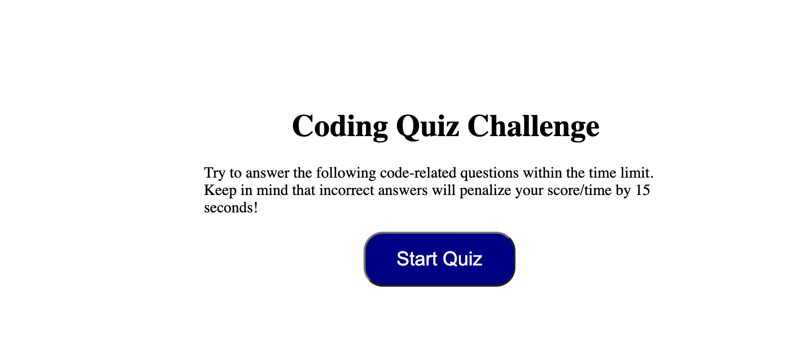
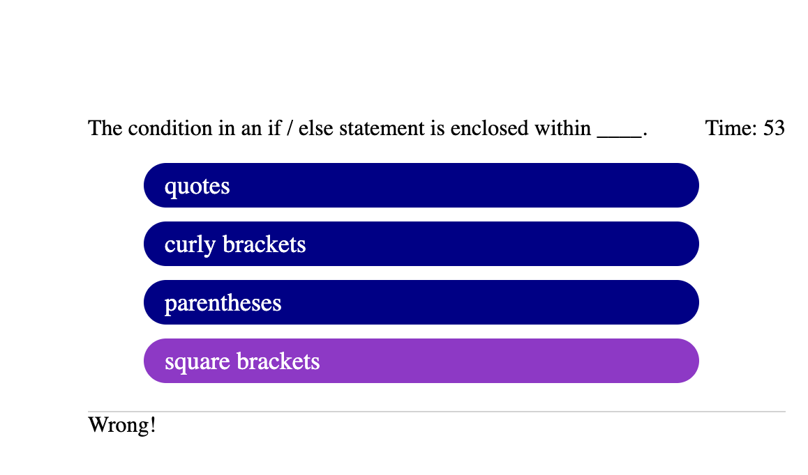
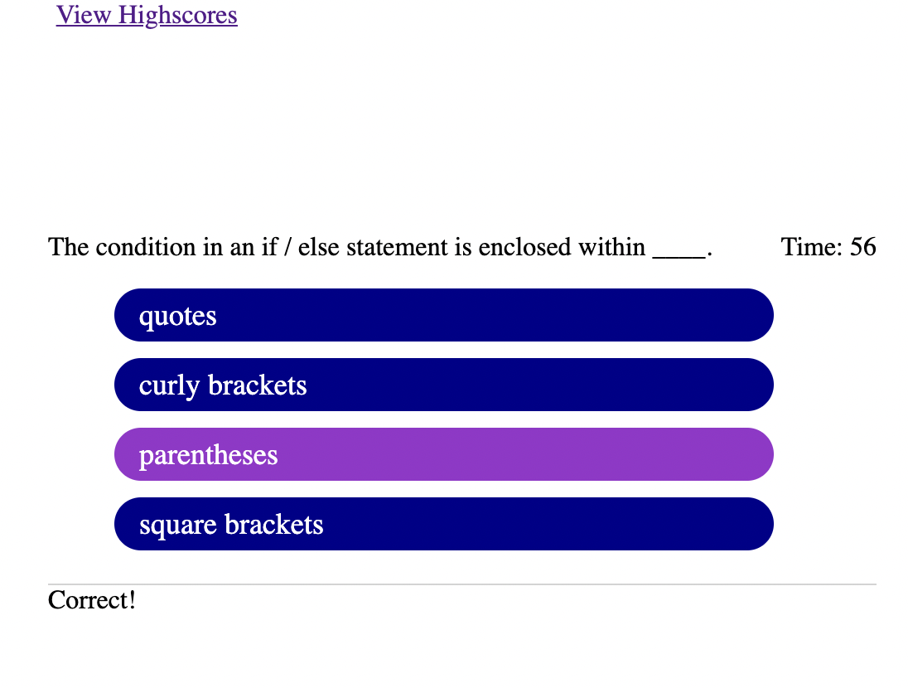
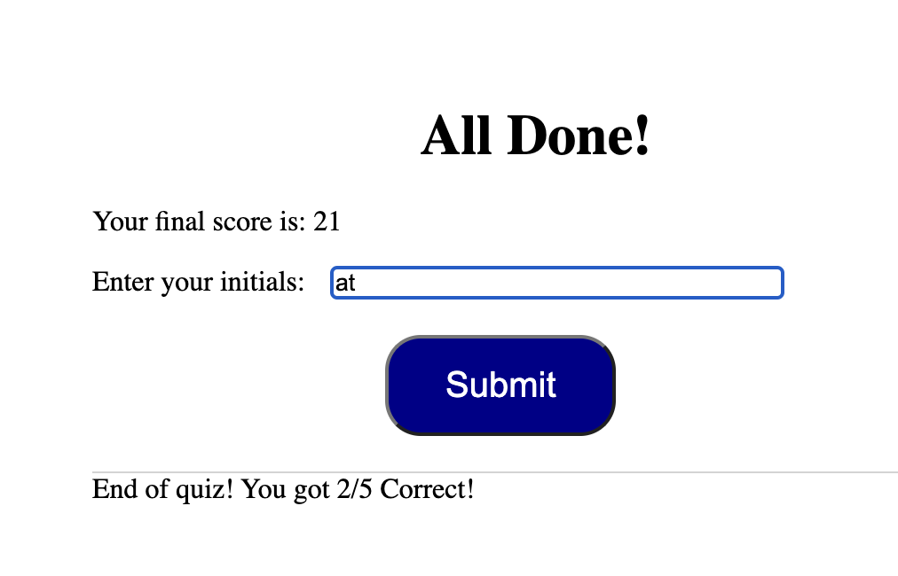
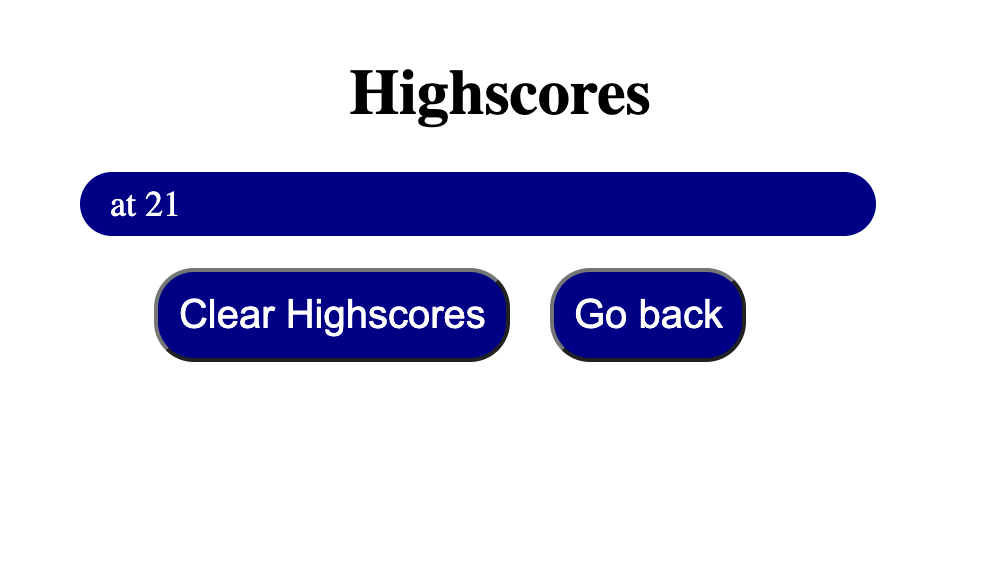

# code-quiz

## Purpose
This is quiz application using HTML, CSS, and javaScript. I used Javascript to provide quiz questions and collect user data to determine whether the answers to a question are correct, this the generates a score and appends a final page of results from user data.

## Built with 
*HTML
*CSS
*JavaScript

## Instruction 
* A start quiz button 

    * This starts a timer for the user

    * Each question averages 15 seconds

* If questions are answered incorrectly, 15 seconds are deducted

*if correct points are not deducted

 * Final score which is calculated using time remaining
  * Input area to record initials
 * A Submit button
 * Submit buttom saves initials and score to local storage

 

 

## Websites

*[Gihub Repository](https://github.com/aidyel/code-quiz)

*[Deployed Gihub IO](https://aidyel.github.io/code-quiz/)